# Привет, меня зовут Ярослав! 👋

Я молодой fullstack разработчик, который каждый день открывает для себя что-то новое в мире программирования 🌟

## Любимые инструменты ❤️
- ML: **TensorFlow** 
- Frontend: **Vue.js**
- Backend: **Laravel**

## Языки программирования 👨‍💻

    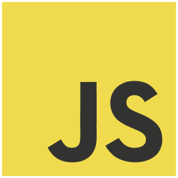
    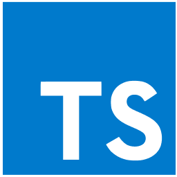
    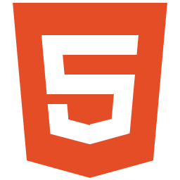
    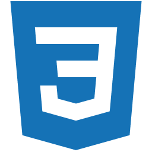
    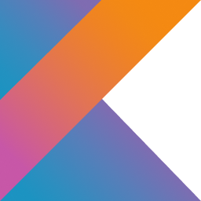
    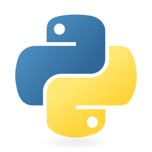
    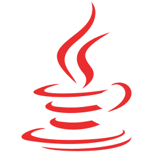
    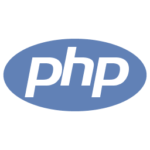

## Мой стек технологий 🛠️

    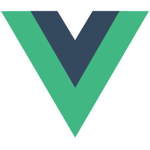
    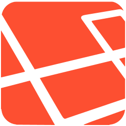
    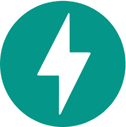
    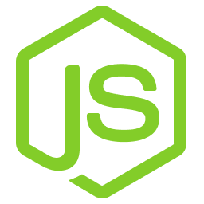
    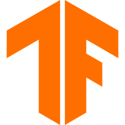
    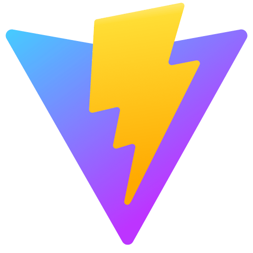
    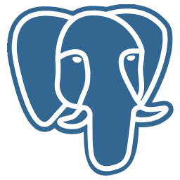
    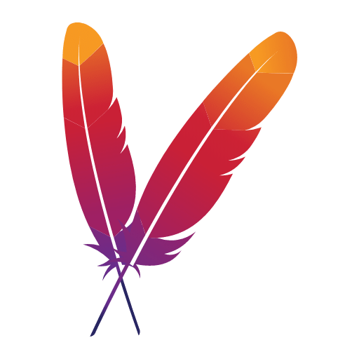
    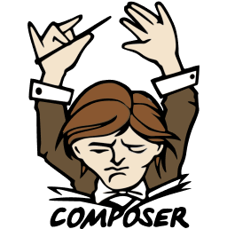
    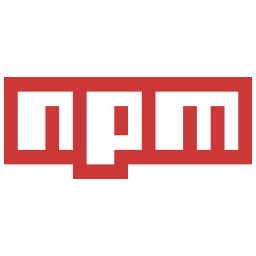
    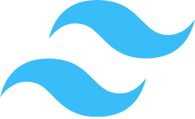

## Мои увлечения 🌟

### Дизайн веб-сайтов 
Для меня дизайн это возможность добавить в работу неного эстетики ✨. 
Хоть я и не профессиональный дизайнер, я всегда стремлюсь создать удобный и интересный интерфейс. 
Часто я ищу вдохновение на Dribbble, изучая различные идеи и концепции для своих проектов.

    
    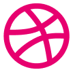

### Видеоигры 🎮
🔥 **Doom Eternal**

🔥 **Hotline Miami**

🔥 **COD MW2 Multiplayer**

🔥 **Unreal Tournament**

### Спортзал 💪
В свободное время от работы я стремлюсь к совершенству не только в виртуальном мире, но и в реальной жизни. 
Посещение спортзала для меня - это не только способ поддерживать физическую форму, но и путь к улучшению самого себя, духовно и физически.

## Моя цель 🎯
Моя цель - не просто создавать программные продукты, а делать их лучше.
Я верю, что мир может стать лучше благодаря технологиям, и я готов внести свой вклад в это.
